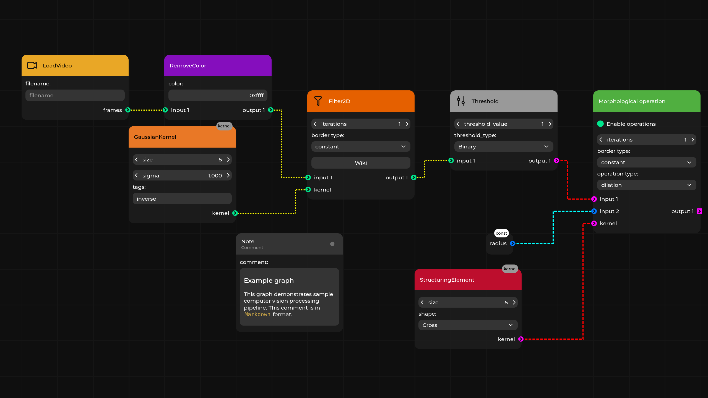

# Pipeline Manager

Copyright (c) 2022-2026 [Antmicro](https://www.antmicro.com)

Pipeline Manager is a data-based, application-agnostic web application for creating, visualizing and managing dataflows in various applications.
It does not assume any properties of the application it is working with, thanks to which fast integration with various formats is possible.

[Pipeline Manager documentation](https://antmicro.github.io/kenning-pipeline-manager/) | [Demo application](https://antmicro.github.io/kenning-pipeline-manager/_static/pipeline-manager.html?spec=https%3A%2F%2Fraw.githubusercontent.com%2Fantmicro%2Fkenning-pipeline-manager%2Frefs%2Fheads%2Fmain%2Fexamples%2Fsample-specification.json&graph=https%3A%2F%2Fraw.githubusercontent.com%2Fantmicro%2Fkenning-pipeline-manager%2Frefs%2Fheads%2Fmain%2Fexamples%2Fsample-dataflow.json)

Pipeline Manager provides functionality for:

* visualizing and editing dataflows
* saving and loading dataflows
* communicating with an external application to delegate advanced validation, execution of the defined graph and conversions to and from native graph formats

Pipeline Manager simplifies the process of developing graph-based graphical interfaces for applications that are modular and have a graph-like nature.



## Prerequisites

Pipeline Manager requires `npm` (at least 10.8.2 version is recommended, along with Node.js starting from 20.10.0), `python` and `pip` for installing dependencies, building and (optionally) running - use package manager to install those packages.

The backend of the application has a list of requirements in the `pyproject.toml` file.
They can be installed using `pip`:

```
pip install .
```

All `npm` modules necessary for the front end of the application are installed automatically during build.
You can find them in the `./pipeline_manager/frontend/node_modules` directory after the application is built.

## Building and running

Pipeline Manager can be built in two different ways, as:

* a static HTML application running in a browser without any additional back end server
* a regular web application designed to communicate and cooperate with an external application (like [Kenning](https://github.com/antmicro/kenning))

### Static HTML application

To build Pipeline Manager as a static HTML application, run the following in the root directory:

```bash
./build static-html
```

To list available flags, run:

```bash
./build static-html -h
```

To run the built application, open `./pipeline_manager/frontend/dist/index.html` in a preferred browser.
For example, if the browser of your choice is `firefox` you should run:

```bash
firefox ./pipeline_manager/frontend/dist/index.html
```

With Pipeline Manager running, you can use a sample specification you can find in the `./examples/sample_specification.json` directory to explore visualization and pipeline editing capabilities.
Additionally, you can use `./examples/sample_dataflow.json` see how dataflows are stored.

You can load the specification on the webpage using the `Load specification` option in the main menu.
You can then load the dataflow on the webpage using the `Load graph file` option in the main menu.

What is more, you can provide the specification and the dataflow as URL arguments:

* `spec` - should contain URL to the specification file
* `graph` - should contain URL to the dataflow file
* `preview` - if `true`, the graph is displayed in preview mode (read only, no HUD)
* `include` - to alter the specification from within the URL, you can provide an URL to additional includes with this field

URL example:

```bash
firefox "https://antmicro.github.io/kenning-pipeline-manager/_static/pipeline-manager.html?spec=https%3A%2F%2Fraw.githubusercontent.com%2Fantmicro%2Fkenning-pipeline-manager%2Frefs%2Fheads%2Fmain%2Fexamples%2Fsample-specification.json&graph=https%3A%2F%2Fraw.githubusercontent.com%2Fantmicro%2Fkenning-pipeline-manager%2Frefs%2Fheads%2Fmain%2Fexamples%2Fsample-dataflow.json"
```

The URL above will fetch and use specification and dataflow from the GitHub repository for this project.
The URLs need to be encoded.

You can add a JSON with a default specification to the generated HTML by providing the path to your file as the second argument for the `./build` script:

```bash
./build static-html <path-to-specification-json>
```

You can also add a default dataflow that will be loaded when the application starts, for example:

```bash
./build static-html <path-to-specification> <path-to-dataflow>
```

To be able to use some additional assets, like icons for nodes, run:

```bash
./build --assets-directory <path-to-assets-dir> static-html <path-to-specification> <path-to-dataflow>
```

To change the title of the editor and page, use the `--editor-title` flag, for example:

```bash
./build --editor-title 'Graph editor' static-html <path-to-specification> <path-to-dataflow>
```

For details on how to write specifications, see:

* [Pipeline Manager documentation](https://antmicro.github.io/kenning-pipeline-manager)
* [Specification format](https://antmicro.github.io/kenning-pipeline-manager/specification-format.html)
* [Dataflow format](https://antmicro.github.io/kenning-pipeline-manager/dataflow-format.html)
* [Examples in `examples/` directory](https://github.com/antmicro/kenning-pipeline-manager/tree/main/examples) - in the directory you can find sample specification files (with `-specification.json` suffix), usually paired with supported dataflow files (with `-dataflow.json` suffix)

For example, you can run:

```bash
./build static-html ./examples/sample-specification.json ./examples/sample-dataflow.json --output-directory ./pipeline-manager-demo
```

Upon a successful build, run:

```bash
firefox ./pipeline-manager-demo/index.html
```

You should get a graph view similar to the one in the [documentation's demo](https://antmicro.github.io/kenning-pipeline-manager/_static/pipeline-manager.html?spec=https%3A%2F%2Fraw.githubusercontent.com%2Fantmicro%2Fkenning-pipeline-manager%2Frefs%2Fheads%2Fmain%2Fexamples%2Fsample-specification.json&graph=https%3A%2F%2Fraw.githubusercontent.com%2Fantmicro%2Fkenning-pipeline-manager%2Frefs%2Fheads%2Fmain%2Fexamples%2Fsample-dataflow.json).

### Web application

To build Pipeline Manager to work with an external application (like Kenning), run the following in the root directory:

```bash
./build server-app
```

For available flags, check:

```bash
./build server-app -h
```

In this scenario, the back-end server is expected to serve the content for Pipeline Manager.
To do that, run the following in the root directory:

```
./run
```

By default, the back-end server runs on `http://127.0.0.1:5000`.
In addition to using the sample specification, you can also connect a third-party application (e.g. [Kenning](https://github.com/antmicro/kenning)), edit its pipeline, validate it and run it.

### Miscellaneous

#### Development

To run a development server which automatically recompiles a project after detecting any changes, in `./pipeline_manager/frontend` directory, for static mode, run:

```
npm run serve-static
```

For web application mode, run:

```
npm run serve
```

#### Validation

Pipeline Manager includes a validation tool you can use during specification and dataflow development.

To validate an existing specification, run the following in the root directory:

```
./validate <specification-path>
```

To validate an existing specification and one or more dataflows, run the following in the root directory:

```
./validate <specification-path> <dataflow-path> <dataflow-path> ...
```

Replace both `specification-path` and `dataflow-path` with the actual paths to the JSON configuration file you want to validate.
When running the validation tool for the first time, make sure to include the `--instal-dependencies` flag.

#### Cleanup

To remove the installed `npm` dependencies and the built application, run the following in the root directory:

```
./cleanup
```

### Using Pipeline Manager as a Python module

To install Pipeline Manager with `pip`, run:

```
pip install -U git+https://github.com/antmicro/kenning-pipeline-manager.git
```

To work directly with the repository, install the module with:

```
pip install -e .
```

All Pipeline Manager scripts can then be used from the command-line interface:

```
pipeline_manager
usage: pipeline_manager {build,run,validate,cleanup}
```
