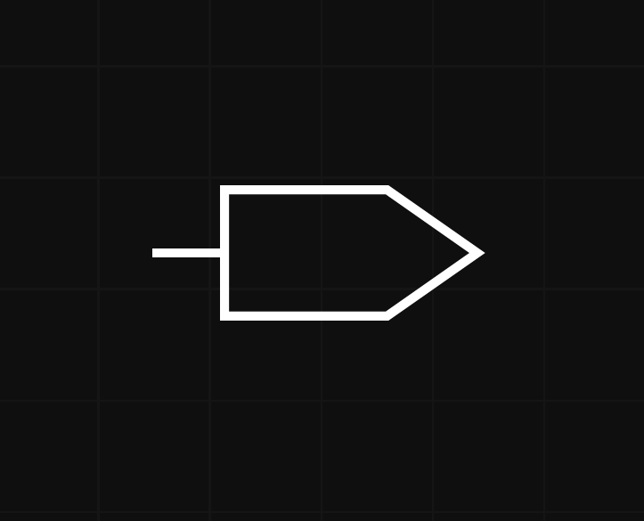
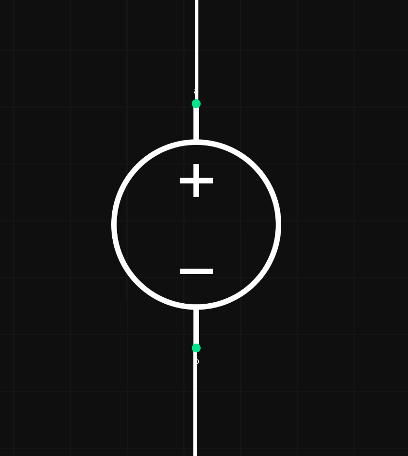

# Custom shaped node

Pipeline Manager gives option for defining nodes with custom shapes defined in SVG files.
It allows to have nodes of any shape representing any objects.

## Quickstart

To create a custom shaped node, a style for that node needs to be defined in the metadata.
In node style, provide a URL path to SVG file with desired shape, using `shape` attribute:

``` json
"metadata": {
    "styles":{
        "MyCustomShape": {
            "shape": "https://raw.githubusercontent.com/antmicro/kenning-pipeline-manager/refs/heads/main/docs/source/_static/svgs/bidirectional.svg"
        },
    }
}
```

Then in specification nodes list, user adds created style:

``` json
"nodes": [
    {
        "name": "bidirectional",
        "style": "MyCustomShape"
    },
]
```

Once the specification is loaded, user should be able to add a node with the custom shape in the editor:



## Custom shaped node styling

Custom shaped node supports setting `width` and `height` through node specification, allowing for different node size.
This allows for having two nodes with the same shape but different sizes.

## Interfaces with custom position

For greater flexibility, custom shaped nodes use interfaces with positions defined by user.

Positions for interfaces are defined in node's style like the custom shape.
Positioned interfaces support two additional sides - `top` and `bottom`
Side of interfaces should be provided explicitly by user in the specification - it is used for rendering connections.
`positions` attribute is used for setting positions of interfaces, where each `position` subattribute is named after the interface to which position should be applied.
Positions are defined in `x` and `y` coordinates relative to node top-left corner and are specified in percentage of node width in case of `x` coordinate and in percentage of node height in case of `y` coordinates.

Example positioned interfaces configuration, for node with two interfaces:

``` json
"metadata": {
    "styles":{
        "VoltageStyle":{
            "shape": "localhost:3000/svgs/voltage.svg",
            "positions": {
                "a": {
                    "x": 50,
                    "y": 0
                },
                "b": {
                    "x": 50,
                    "y": 95
                }
            }
        },
    }
}
```

In this configuration `VoltageStyle` is the style used for node representing voltage symbol in electronic circuits and have two interfaces with defined positions, node specification:

``` json
"nodes": [
    {
        "name": "Voltage",
        "interfaces": [
            {"name": "a", "direction": "inout", "side": "top"},
            {"name": "b", "direction": "inout", "side": "bottom"}
        ],
        "style": "VoltageStyle"
    },
]
```

`x` coordinate for `a` and `b` interfaces are set to 50% which means they are centred, `a` interface `y` coordinate is set to 0% which means it is placed at top of the node, for `b` interface `y` is set to 95% which places it slightly above the bottom of the node.

`Voltage` node should look like this in the Pipeline Manager editor:



## Adding positioned interfaces

When node shape is set, `Add interface` option in a context menu allows for setting interface side and interface position.
After `Add interface` button in the context menu is pressed, user simply clicks on the part of the node where the interface should be placed.
It automatically updates node's specification and node's style, so changes are permanent and can be exported through specification saving.