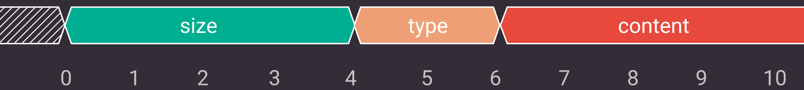

# Communication with an external application

The communication with an external application is based on a TCP protocol and BSD sockets.
{{project}} implements a TCP server that is listening on a specifed port and waiting for the client to connect.
{{project}} sends requests to the connected client for specific actions described in this chapter.

```{note}
The client should not send any messages to the server without getting a request message first.
```

## Communication protocol

The application layer protocol specifies three blocks:

* `size` - four first bytes form an unsigned integer and tell the size of the content of the message in bytes.
* `type` - two following bytes, which are also an unsinged integer describing the type of the message.
* `content` - the rest of the message holding additional, `type`-specific data.

The `size` and `type` are stored in big-endian.



## Message types

### Response messages - sent by the external application

#### OK

Message of `type` `OK` (0) is used to indicate a success and optionally includes an answer to a previous request.
Its `content` may vary depending on the request type.

#### ERROR

Message of `type` `ERROR` (1) is used to indicate a failure and optionally includes an answer to a previous request.
Its `content` may vary depending on the answered request.

### Request messages - sent by {{project}}

#### VALIDATE

Message of `type` `VALIDATE` (2) requests validation for a dataflow present in `content`.
This request expects a return message of `type` `OK` if the validation is successful or `ERROR` otherwise.
Optionally, a feedback message encoded in UTF-8 can be included in `content`.
The feedback will be displayed to the user.

#### SPECIFICATION

Message of `type` `SPECIFICATION` (3) requests for a specification in the format defined in [Specification format](specification-format) to be sent back to the {{project}}.
The provided specification is used to create a new environment in the editor.
This request expects a return message of `type` `OK` if a specification is sent or `ERROR` otherwise.
If the return message is of `type` `OK` then a specification of nodes encoded in UTF-8 in `content` is present.
If the return message is of `type` `ERROR`, it can optionally include a feedback message in `content`.

#### RUN

Message of `type` `RUN` (4) requests running a dataflow present in `content`.
Method execution depends on the implementation on the client side.
This request expects a return messages of `type` `OK` if the run is successful or `ERROR` otherwise.
Optionally, a feedback message encoded in UTF-8 can be included in `content`.
The feedback will be displayed to the user.

#### IMPORT

Message of `type` `IMPORT` (5) requests a graph from `content` to be parsed into a {{project}} format that can be loaded by the editor.
The loaded graph format depends on the client application.
The client should parse the graph structure in a supported format and convert it to the [Dataflow format](dataflow-format).

This request expects a return messages of `type` `OK` if the parsing is successful or `ERROR` otherwise.
If the request is successful, the parsed dataflow should be sent within `content`.

#### EXPORT

Message of `type` `EXPORT` (6) requests the dataflow present in the editor to be saved to the filesystem in a format supported by the client application.

In the `content` of the `EXPORT` message, there is a dataflow specification encoded in UTF-8, in the format specified in [Dataflow format](dataflow-format).

This request expects a return message of `type` `OK` if the saving process is successful or `ERROR` otherwise.
Optionally, a feedback message encoded in UTF-8 can be included in `content`.
The feedback will be displayed to the user.

#### PROGRESS

Message of optional `type` `PROGRESS` (7) is used to inform {{project}} about the status of a running dataflow. The
`PROGRESS` message type can only be used once a message of type `RUN` is received and can be sent multiple times before sending a final response message of type either `ERROR` or `OK` that indicates the end of the run.
The progress information is conveyed in `content` using a number ranging `0 - 100` encoded in UTF-8 that signals the percentage of completion of the run.
See [RUN](#run) for more information.

## Implementing a python-based client for {{project}}

The communication described above is necessary to integrate an application with {{project}}.
The client needs to be able to read requests coming from {{project}} and send proper responses.

For applications is written in Python, you can use the [pipeline-manager-backend-communication](https://github.com/antmicro/kenning-pipeline-manager-backend-communication) library.
It implements an easy-to-use interface that is able to communicate with {{project}} along with helper structures and enumerations.

The main structures provided by the `pipeline-manager-backend-communication` library are:

* `CommunicationBackend` - class that implements the functionality for receiving and sending messages.
* `MessageType` - enum used to easily distinguish message types.
* `Status` - enum that describes the current state of the client.

The following code is an example of how to receive requests and send responses to {{project}}:

```python
host = '127.0.0.1'
port = 5000

# Creating a client instance with host and port specified
client = CommunicationBackend(host, port)
# Connecting to Pipeline Manager
client.initialize_client()
```

First, a TCP client, that connects to {{project}} using `host` and `port` parameters provided has to be created.

```python
while True:
    # Receiving a message from Pipeline Manager
    status, message = client.wait_for_message()

    # Checking whether the message is ready to be read
    if status == Status.DATA_READY:
        # Receiving a message from Pipeline Manager
        message_type, data = message
```

Once the connection is established, the application can start listening for the incoming requests.
Function `wait_for_message()` blocks indefinitely until some data is read from the socket.
It returns a tuple that consists of the `status` of the client and the `message` read.
If the `status` equals `DATA_READY`, a full message was successfully parsed and read.
As described in the [Communication protocol](#communication-protocol) section, a `message` includes a `message_type` and the `data` sent (named there `content`).

{ emphasize-lines="23-33" }
```python
from pipeline_manager_backend_communication.communication_backend import \
    CommunicationBackend
from pipeline_manager_backend_communication.misc_structures import \
    MessageType, Status

host = '127.0.0.1'
port = 5000

client = CommunicationBackend(host, port)
client.initialize_client()

while True:
   status, message = client.wait_for_message()

   if status == Status.DATA_READY:
       message_type, data = message

       if message_type == MessageType.SPECIFICATION:
           client.send_message(
               MessageType.OK,
               create_and_encode_specification()
           )
       elif message_type == MessageType.VALIDATE:
            if validation_successful(data):
                client.send_message(
                    MessageType.OK,
                    'Successfully validated'.encode()
                )
            else:
                client.send_message(
                    MessageType.ERROR,
                    'Something went very, very bad...'.encode()
                )
```

Sending appropriate responses based on request [message types](#message-types) is what now remains for the implementation to be complete.

The `MessageType` enum provides all available message types.
The highlighted part of the code checks whether a validation request was sent.

```{note}
`validation_successful` is just a demonstration method, it needs to be replaced with an actual validation function for the project.
```

`data` contains the dataflow to be validated by the third-party application.
A response message of type `OK` or `ERROR` can be sent to the {{project}} using a `send_message` function with an additional textual message that to be displayed to the user.
