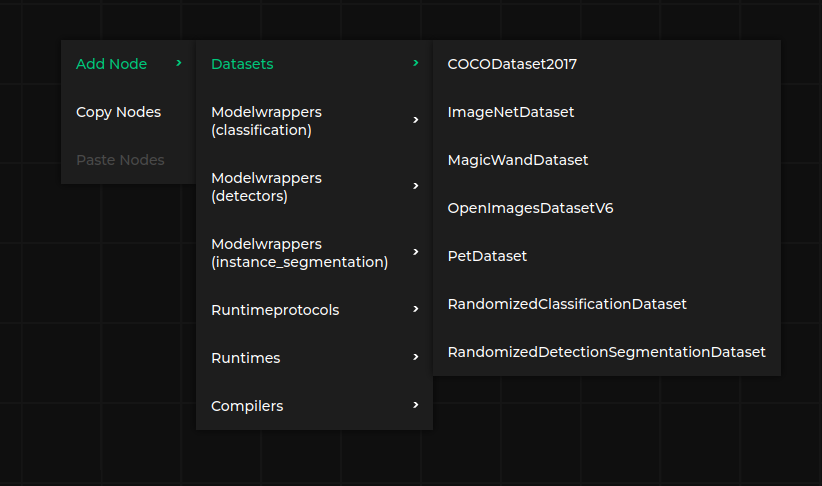

# Frontend features

## Manipulating the graph



To add a new node in the editor, right-click in the editor's canvas and select the preferred node.
It is also possible to select an existing node to copy and paste them with `Copy Nodes` and `Paste Nodes`.

It is possible to remove the node either by right-clicking on node and clicking `Delete`.
The node can be also removed with `Delete` key after selecting it.

Scrool allows to zoom in and zoom out the view, left-click on canvas allow to move around the canvas.

Left-clicking on node allows to select and drag node from one place to another.

To create a connection, left-click on connector and connect it to other connector (of a matching type, see [Specification format](specification-format)).
To remove a connection, left-click on input connector for a given connection.

## Notifications


Pipeline manager provides notifications describing the errors occuring in:

* The frontend, such as invalid input specification, or invalid dataflow
* The backend (see [Communication with an external application](external-app-communication))

It allows to display various messages to the user during development or execution of the pipeline.

## Loading files


Depending on the mode of the application (`static-html` or `server-app`), the following options will be available in the {{project}} menu:

* `Load specification` - allows to load the specification file describing the nodes that can appear in the graph (see [Specification format](specification-format))
  ```{note}
  It appears only in `static-html` build mode, where specification is not delivered by a third-party app.
  ```
* `Load graph file` - allows to load graph specification in the internal format of {{project}} (see [Dataflow specification](dataflow-format))
* `Load file` - loads file describing the graph in the native format supported by third-party application using {{project}} for visualization.
  ```{note}
  It appears only in `server-app` build mode, since third-party app performs conversion from its native format to [Dataflow format](dataflow-format)
  ```
* `Save file` - saves the current graph in the native format supported by third-party application using {{project}} for visualization.
  ```{note}
  It appears only in `server-app` build mode, since third-party app performs conversion from received [Dataflow format](dataflow-format) from the editor to its native format.
  ```

## Working with the server

 

When {{project}} works in `server-app` mode, it is connected to an external application allowing to run the graph, validate the graph, save and load files in the application's native format.

The command executed by the `Play` icon depends on the implementation of the application - in [Kenning](https://github.com/antmicro/kenning) it either compiles and evaluate the model, or run the Kenning Flow application.

The second icon allows to validate the graph before running - it allows the third-party application to run more thorough tests of the visualized pipeline before running it.

The third icon shows the status of the third-party application (red color means disconnected, green color means connected).

## Testing the frontend features

The best way to test the frontend features is to use the `pipeline_manager.frontend_tester.tester_client`, [Example of third-party server](example-server).
