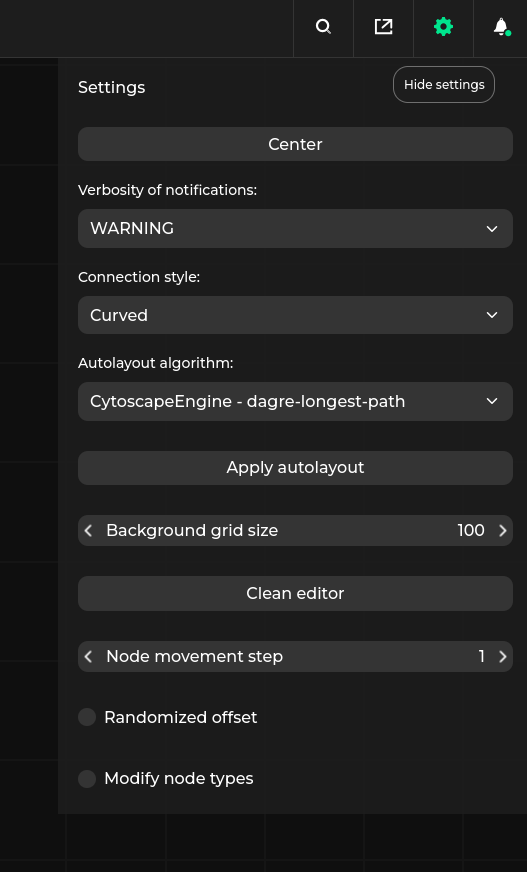

# Front-end features

## Graph manipulation


On the left side there is a node palette (which can be turned off or on using the green icon in the upper left corner).
To add a new node to the graph, click the node in the palette and drag it to the editor.
You can also select existing nodes and copy and paste them using `ctrl-c` and `ctrl-v` keyboard shortcuts.


In the upper right corner of each node there is a context menu toggle. It contains the following options:
* `Rename` - Changes instanceName of the node. More details regarding node naming can be found in the ['instanceName' field of dataflow format](project:dataflow-format.md#node)
* `Delete` - Deletes the node from the dataflow. Another way of deleting nodes is to select and press the `Delete` key.
* Additional, user defined URLs. More details in the [URL specification](project:specification-format.md#url-class)

Scroll lets you to zoom in and out.
Left-clicking and dragging the editor background allows you to move around the editor area.

Left-clicking on a node allows you to select and drag the node within the editor area. Pressing the `ctrl` key while moving a node allows you to align the node with another one along some axis.

To create a connection, left-click a node's connector and connect it to a connector (of a matching type, see [Specification format](specification-format)) on another node.
Double left-click on an existing connection removes it.

## Settings



On the upper right corner of {{project}} window there is a gear icon toggling settings tab. In the tab following options can be found:
* `Connection style` - Switch the style of the connection between `orthogonal` and `curved`
* `AutoLayout algorithm` - Choose the algorithm for automatic node placement. Autolayout algorithm is triggered in the following situations:
  * When loading the dataflow autolayout is used to place nodes without the `position` parameter set. Dataflow load can be triggered either via external application or
  choosing the `Load graph file` option. In this case autolayout is applied to both the main graph and the nodes in the subgraphs.
  * By pressing the `Apply autolayout` button in the settings tab. In this case autolayout is applied to the entire graph.
* `Background grid size` - Sets the size of single grid cell visible in the background
* `Node movement step` - Sets the minimum step size which can be taken along each axis when moving node.
* `Center` - Pressing this buttons moves the viewport to the center of graph and sets the zoom level so that whole dataflow is visible
* `Hide layers` - [Metadata](project:specification-format.md#layer) allows to specify layers for a certain set of interface types and connections. Toggling this checkbox allows to hide
connections belonging to said layer

## Notifications


{{project}} provides notifications describing errors occurring in:

* The front end, such as invalid input specification, or invalid dataflow
* The back end (see [Communication with an external application](external-app-communication))

During pipeline development or execution, notifications can display various messages to the user.

## Full screen


Near the settings tab, there is a full screen icon. Clicking it will expand the {{project}} window to full screen.
Note that this feature may be disabled during embedding {{project}} in an external application, make sure to allow full screen mode.

For example, in the case of embedding {{project}} in an iframe, the `allow="fullscreen"` attribute must be set:
```html
<iframe src="https://url" allow="fullscreen">
  <p>Your browser does not support iframes.</p>
</iframe>
```

## Editor menu


Depending the application's mode (`static-html` or `server-app`), the following options will be available in the {{project}} menu:

* `Load specification` - lets the user load a specification file describing the nodes that can appear in the graph (see [Specification format](specification-format))
  ```{note}
  It appears only in the `static-html` build mode, where a specification is not delivered by a third-party app.
  ```
* `Load graph file` - lets the user load a graph specification in {{project}}'s internal format (see [Dataflow specification](dataflow-format)).
* `Save graph file` - Saves the graph currently stored in the editor into JSON using {{project}}'s internal format.
* `Export graph to PNG` - Saves the graph currently stored in the editor as PNG image
* `Load file` - lets the user load a file describing a graph in the native format supported by the third-party application using {{project}} for visualization.
  ```{note}
  It appears only in the `server-app` build mode, since the third-party app performs conversion from its native format to the [Dataflow format](dataflow-format)
  ```
* `Save file` - saves the current graph in a native format supported by the third-party application using {{project}} for visualization.
  ```{note}
  It appears only in the `server-app` build mode, since the third-party app performs conversion from the [Dataflow format](dataflow-format) received from the editor to its native format.
  ```

## Working with the server

 

When {{project}} works in the `server-app` mode, it is connected to an external application, making it possible to run or validate a graph as well as save and load files in the application's native format.

The command executed by the `Play` icon depends on the implementation of the application - for [Kenning](https://github.com/antmicro/kenning), it either compiles and evaluates the model, or runs the Kenning Flow application.

The second icon lets the user validate a graph before running it by allowing the third-party application to run more thorough tests of the visualized pipeline.

The third icon displays the status of the third-party application (red means disconnected, green means connected).

## Testing the front-end features

The best way to test the front-end features is to use the `pipeline_manager.frontend_tester.tester_client`, [Third-party server example](example-server).
