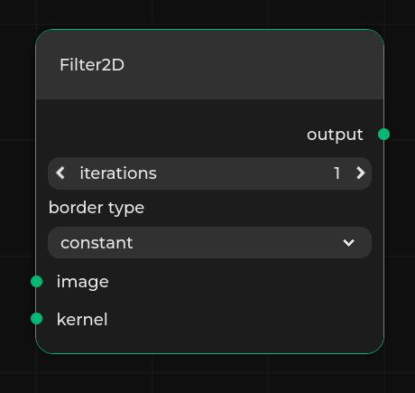

# Specification format

{{project}} requires a JSON specification that defines the working environment.
It specifies all nodes, properties, available connections, and metadata for the editor.
It can be either provided from a file or fetched from an [external application](external-app-communication).

Such a specification defining the nodes needs to be loaded through the front end in order for you to be able to load any dataflow.

## Format description

The specification needs to be provided in a JSON file.
The specification consists of:

* `metadata` - object of type [Metadata](#metadata) that specifies editor styling and metadata
* `nodes` - array that specifies valid nodes, where every element is of type [Node](#node).
* `graphs` - array of dataflow-like objects defining graph nodes, of type [Graph](project:dataflow-format.md#graph).
* `include` - array of string objects pointing to a remote url to the specifications to include.
* `includeGraphs` - array of objects of type [Included Graph](#included-graphs), that specifies graph instances to be included in the specification from a remote url.
* `version` - string determining version of the specification.
  Should be set to the newest version described in [Changelogs](#changelogs).
  {{project}} uses that value to check the compatibility of the specification with the current implementation, giving warnings about inconsistency in versions.

```{note}
Graph node named `New Graph Node` is available by default after loading a specification.
It can be used to create new, custom graphs.
That is why using this name for a graph will result in an error.
```

(specification-format-metadata)=
### Metadata

This object specifies additional editor options and contains the following optional properties:

* `interfaces` - a dictionary which defines interface and connection styling for particular interface types.
  The key in the dictionary is the name of the interface type, and the value is of type [Interface style](#interface-style).
* `allowLoopbacks` - boolean value that determines whether connections with endpoints at the same node are allowed.
  Default value is `false`.
* `readonly` - boolean value determining whether the editor is in read-only mode.
  In read-only mode, the user cannot create or remove nodes and connections.
  Modification of any properties is also disabled.
  The user is only allowed to load existing dataflows.
  Default value is `false`.
* `twoColumn` - boolean value determining the layout of the nodes.
  If set to `true`, then input and output sockets are both rendered in the top part of the node and properties are displayed below.
  Default value is `false`.
* `connectionStyle` - string value that determines the connection style.
  Can choose one out of the two options: `curved` or `orthogonal`.
  Default value is `curved`
* `hideHud` - boolean value determining whether UI elements should be hidden. Components affected by this flag are: popup notifications, navigation bar and terminal window.
  Default value is `false`
* `layers` - layers specifying groups of interfaces and nodes that can be hidden in the viewer from settings level.
  The entries are of type [Layer](#layer).
  By default there are no layers.
* `urls` - list of URL classes present in the specification and flow.
  It is a dictionary, where key is the name of the URL class, and value is of type [URL class specification](#url-class).
  The given URL classes can be referred to later in [Nodes](#node) with proper link suffix.
* `collapseSidebar` - boolean value determining whether nodes sidebar should be collapsed by default.
  Default value is `true`
* `movementStep` - Defines offset to which nodes snap in the grid.
  Default value is `1`.
* `backgroundSize` - Defines size of the background grid.
  Default value is `100`.
* `layout` - String specifying the name of autolayout algorithm used in placing nodes from dataflow
  Default value is `NoLayout`
* `icons` - contains definition of icon classes.
  Icon classes are key-value pairs, where key is the name of the icon class, and value is the URL prefix that is used to compute the actual path.
* `navbarItems` - list of buttons that are displayed in the navbar in `server-app` mode, that allow for calling custom procedures.
  The entries are of type [Navbar item](#navbar-item).
* `logLevel` - string specifying minimum level of verbosity notification has to have to be displayed.
  It can be one of `INFO`, `WARNING`, `ERROR`.

An example:

```json
"metadata": {
    "interfaces": {
        "Dataset": {
            "interfaceColor": "#FF00FF",
            "interfaceConnectionPattern": "dashed",
            "interfaceConnectionColor": "#FF0000"
        }
    },
    "allowLoopbacks": false,
    "readonly": true,
    "connectionStyle": "orthogonal",
    "hideHud": false,
    "layers": [
        {
            "name": "Example Layer",
            "nodeLayers": ["processing"],
            "nodeInterfaces": ["BinaryImage"]
        }
    ],
    "layout": "NoLayout"
}
```

#### Layer

Layer is used to describe a set of types of nodes and interfaces.
Layers can be used to hide nodes of given types.
They can be also used to hide connections for given interface types.

The layers can be enabled or disabled in editor settings.

Every layer has three properties (at least `name` and one of `nodeLayers` or `nodeInterfaces` need to be defined):

* `name` - name of the layer displayed in the editor,
* `nodeLayers` (optional) - array of names of node types that belong to the layer,
* `nodeInterfaces` (optional) - array of names of interface types that belong to the layer.

#### URL class

URL class provides links with additional information for a given node.
They are represented in nodes as icons leading to a URL with additional information on nodes.

The name of the URL class is specified as key in `urls` entry in metadata.

The URL class parameters are following:

* `name` - name of the URL class, appears as hint on hover over the icon,
* `icon` - path to the icon representing the URL class,
* `url` - base URL for URL class.
  The suffixes for URLs are present in [Node](#node) parameters.

#### Interface style

Interface style describes how interfaces of a given type should look like, as well as its input or output connections.
It consists of the following properties:

* `interfaceColor` - describes the color of the interface, should be a hexadecimal number representing RGB values.
* `interfaceConnectionPattern` - describes how the connection line should look like.
  The possible variants are `solid`, `dashed` and `dotted`.
* `interfaceConnectionColor` - describes the color of connection lines, should be a hexadecimal number representing RGB values.

(metadata-navbar-item)=
#### Navbar item

Describes a list of custom buttons displayed in the navbar.
Every element consists of the following properties:

* `name` - displayed as a tooltip to the user when the button is hovered.
  Names have to be unique.
* `stopName` - name displayed in the tooltip when the corresponding procedure is running and is stoppable.
  If not specified simply 'Stop' is added as a prefix to the name.
* `iconName` - name of the icon that is used.
  It can be either a file in the assets directory, or an icon described in `/pipeline-manager/pipeline_manager/frontend/src/icons/index.ts`.
* `procedureName` - name of the procedure (either a built-in [API procedure](#api-specification) or a [custom procedure](#api-custom-procedure)) to be called.
  It is assumed that the procedure accepts a does not need any arguments, or takes one argument which is the currently displayed dataflow (similarly to [dataflow_run(#external-dataflow-run)]).
* `allowToRunInParallelWith` - a list of procedure names that can be started in parallel to the currently running job.

Example of a button that is used to run the current graph using a dedicated procedure `dataflow_run` looks as follows:

```json
{
    "name": "Run",
    "stopName": "Stop",
    "iconName": "Run",
    "procedureName": "dataflow_run",
    "allowToRunInParallelWith": [
        "dataflow_validate",
        "custom_lint_files"
    ]
}
```

This will create a button called Run, with the `Run` icon (available built-in icon), which upon clicking will run `dataflow_run` method.
During execution of the `dataflow_run` method, we can run in parallel `dataflow_validate` and `custom_lint_files` procedures.

```{note}
By default, only single action can be called from NavBar at a time.
```

```{warning}
`allowToRunInParallelWith` is a one-way relation.
This means that if we have two actions that can be started when the other one is running, then `allowToRunInParallelWith` needs to be defined in both actions.
```

### Node

This object specifies a single node.

* `name` - name displayed in the editor.
* `layer` - layer type used for styling and toggling the node visibility in the editor.
* `category` - context menu category displayed in the editor.
* `icon` - name of an SVG icon that is going to be displayed next to the name of the node.
  The value of `icon` can be:

  * `string` containing the path to the icon relative to the `assets` directory, e.g. `filter.svg` for `pipeline_manager/frontend/dist/assets/filter.svg`
  * `string` containing the URL to the remote image file
  * `{"key": "value"}` pair, where `key` is the name of the icon class created in `icons`, in [Metadata](#metadata), and `value` is a suffix of the URL.
  ``````{note}
  The `assets` directory can be created and filled manually or added by `build` script with `--assets-directory <path-to-directory-with-icons>`, e.g.:
  ```bash
  ./build --assets-directory examples/sample-assets static-html static-html examples/sample-specification.json
  ```
  ``````
* `interfaces` - array representing inputs, outputs and bidirectional ports for nodes.
  The entries are of type [Interface](#interface).
* `properties` - array with elements of type [Property](#property),
* `interfaceGroups` - array with elements of type [Interface Groups](#interface-groups),
* `defaultInterfaceGroups` - array of objects that specifies which interface groups are enabled by default.
  Every object should contain a `name` and `direction` of an [Interface Groups](#interface-groups).
* `urls` - a dictionary of [URL class](#url-class) and URL suffixes pairs.
  The key should be a URL class key from `urls` in `metadata`.
  The value of the entry is appended to the URL base from the URL class.
* `abstract` - boolean determining whether the node type is abstract or not.
  Abstract node types are used only for inheritance purposes, they do not appear in the final list of available nodes.
  They only have one mandatory field - `name`.
  The rest of the fields can be provided to introduce some common properties of classes inheriting from it.
* `additionalData` - can be any JSON-like object (array, dictionary, number, string, ...), it is only used for storing some additional, node-specific data, such as comments etc.
* `description` - description of the node in markdown format that is displayed in a sidebar node.
* `isCategory` - determines whether the node is both a category and a node.
  If set to true, then the `name` of the node is inferred from the last text segment in the `category` parameter.
  If any node has a node category in its `category` path then it has to extend from the nearest ancestor category node.
  Additionally, if a node extends from a category node, then it has to be in its subtree.

Some or all of the properties above (except for `name`) can be derived from existing node types using the `extends` list - check [Node type inheritance](#node-type-inheritance).

Here is an example of a node:

```json
{
    "name": "Filter2D",
    "layer": "filters",
    "category": "Filters",
    "icon": "filter.svg",
    "description": "Node that applies a *2D* filter.",
    "properties": [
        {
            "name": "iterations",
            "type": "integer",
            "default": 1
        },
        {
            "name": "border type",
            "type": "select",
            "values": ["constant", "replicate", "wrap", "reflect"],
            "default": "constant"
        }
    ],
    "interfaces": [
        {
            "name": "image",
            "type": "Image",
            "direction": "input"
        },
        {
            "name": "kernel",
            "type": "Image",
            "direction": "input"
        },
        {
            "name": "output",
            "type": "Image",
            "direction": "output"
        }
    ]
}
```

#### Interface

An object that specifies a single input, output or inout interface of node.
Every interface object has following properties:

* `name` - name of the input displayed in the editor
* `type` - type of the input used for styling and validation purposes.
  Can be either a list of strings or a single string.
  If two interfaces have at least one matching type, they can be connected.
  The first type in the list is a "base" type - it is used to color the interface based on [Interface style](#interface-style).
  If only one type between two interfaces is matching, the connection style matches the one defined for this particular type.
  Otherwise, if multiple types are matching, a white solid line for connection is rendered.
* `direction` (optional) - type of the interface in terms of direction, it can be:

    * `input` - interface accepts input data,
    * `output` - interface returns output data.
    * `inout` - interface can both produce outputs and receive inputs.

  The default value is `inout`.

* `maxConnectionsCount` (optional) - specifies the maximum allowed number of connections for a given port.
  Value less than 0 means no limit for connections for a given interface.
  Value equal to 0 means default behavior - one allowed connection to inputs, many allowed connections from outputs.
  The default value is 0.
* `side` (optional) - specifies the side on which the interface is rendered.
  Value can be either `left` or `right`.
  Interfaces with `direction` set to `input` or `inout` are by default rendered on the left side of the node.
  Interfaces with `direction` set to `output` are by default rendered on the right side of the node.
* `dynamic` (optional) - determines whether the interface should be dynamic, which means that the number of interfaces created of this definition can be changed in the editor.
  For each dynamic interface definition, a new property is added to the node that allows the user to change the number of interfaces.
  The name of the property is determined by the `name` and `direction` of the dynamic interface.
  The format is `{name} {direction} count`, so it is important not to create conflicting properties.
  The name of the dynamic interfaces is `{name}[{i}]`, where `i` is the index of the interface.
  `dynamic` property can be either `true`, then the maximum number of interfaces is not limited, or an array in a form of `[min, max]` that specifies the range of interfaces.
  All created interfaces share the same `maxConnectionCount` and `type` values.
* `array` (optional) - special keyword to easily define a range of interfaces.
  Value has to be a list with two integer values that specify the range of interfaces.
  For example, for an `example` interface with `array: [0, 2]` two interfaces called `example[0]` and `example[1]` are created.
* `sidePosition` (optional) - specifies the row on which the interface is rendered.
  Values for interfaces of the same `side` value have to be unique.
  If the value is not provided then rows are automatically provided by iterating from the first upper row.
  This value does not work for `array` keyword, as it produces more than one interface.
* `externalName` (optional) - used for graph nodes only, to expose an interface of a node within the graph.
  It specifies the name of the interface of the graph.
  Both the interface of the graph node and the interface of the node within the graph must have the same `id` and `direction` fields.
  Note that values of `externalName` of the graph node have to be unique.

```{note}
Only interfaces of the same `type` can be connected together.
```

#### Property

An object that specifies a single property.
Every project object has three required base properties:
* `name` - name of the property.
* `type` - type of the property.
* `default` - specifies a default selected value
  Its type depends on the `type` chosen.

There are nine possible values for the `type` property.
* `text` - property is a string.
  A text field is displayed to the user.
* `constant` - property is a string.
  A non-modifiable text field is displayed to the user.
* `number` - property is a float.
  A number field is displayed to the user.
* `integer` - property is an int.
  A number field that only accepts integers is displayed to the user.
* `select` - property is a string with a defined range.
  It requires a `values` property.
* `bool` - property is a bool.
  A bool representing boolean value
* `slider` - property is a float with a specified range.
  It requires `min` and `max` properties.
* `list` - property is a list of arguments of the same type, which can be specified using `dtype`.
* `hex` - property is a string representing base-16 number which has to match the following regex: `/0x[a-fA-F0-9]`.


Additional properties:

* `min` - specifies the left end of a range or minimal value of the base-16 number.
* `max` - specifies the right end of a range or maximal value of the base-16 number.
* `values` - specifies a range of possible values for `select`.
* `dtype` - specifies data type of elements in a `list`.
  Supported values are `string`, `number`, `integer`, `boolean`.
* `description` - description of the property.
  In some cases, it can be displayed to the user.
* `group` - object of type [Group](#group).

##### Group

Array with elements of type [Property](#property).
It defines properties that are toggled by the property.
`group` can only be used with property of type `bool`.

Example group of properties:
```json
{
    "name": "Group", "type": "bool", "default": true, "group": [
        {"name": "prop-a", "type": "integer", "default": 1},
        {"name": "prop-b", "type": "text", "default": ""}
    ]
}
```

#### Node type inheritance

It is possible to inherit:

* `layer`
* `category`
* `icon`
* `interfaces`
* `properties`
* `urls`

From existing node types using the `extends` parameter.
The parameter accepts a list of node types.
The node type is computed by iteratively updating node type definition structures, going through all node types in the `extends` list (in the specified order), and then applying parameters from the current node type.

Below is a sample specification with used inheritance mechanism:

```json
{
    "nodes": [
        {
            "name": "Type A",
            "layer": "class",
            "category": "Classes",
            "properties": [
                {"name": "prop-a", "type": "text", "default": ""}
            ],
            "interfaces": [
                {"name": "output-a", "type": "Interface", "direction": "output"}
            ]
        },
        {
            "name": "Type B",
            "extends": ["Type A"],
            "properties": [
                {"name": "prop-b", "type": "text", "default": ""}
            ],
            "interfaces": [
                {"name": "output-b", "type": "Interface", "direction": "output"}
            ]
        },
        {
            "name": "Type C",
            "layer": "class",
            "category": "Classes",
            "properties": [
                {"name": "prop-c", "type": "text", "default": ""}
            ],
            "interfaces": [
                {"name": "input-c", "type": "Interface", "direction": "input"}
            ]
        },
        {
            "name": "Type D",
            "extends": ["Type B", "Type C"],
            "properties": [
                {"name": "prop-d", "type": "text", "default": ""}
            ],
            "interfaces": [
                {"name": "inout-d", "type": "Interface", "direction": "inout"}
            ]
        }
    ]
}
```

```{warning}
Node types can not be repeated (explicitly in list or implicitly through inheritance) in the `extends` list.
```

Moreover, it is possible to override inherited properties and interfaces.
This mechanism requires using the same name and `"override"` attribute set to `true`.
Only attributes used in the child node are overridden, others are inherited without change.
For instance:

```json
        {
            "name": "Type D",
            "extends": ["Type B", "Type C"],
            "properties": [
                {"name": "prop-a", "type": "number", "default": 1.4, "override": true},
                {"name": "prop-c", "type": "integer", "default": 5, "override": true},
                {"name": "prop-d", "type": "text", "default": ""}
            ],
            "interfaces": [
                {"name": "inout-d", "type": "Interface", "direction": "inout"},
                {"name": "output-a", "type": "Interface", "direction": "inout", "override": true}
            ]
        }
```

### Interface Groups

Object similar to a single interface but reserves a range of interfaces.
`name`, `type`, `direction`, `maxConnectionsCount` and `side` are the same as in a regular [Interface](#interface).
The only difference is that a range of interfaces has to be defined which describes constraints of an interface.
For example two interface groups can be defined that consist of common interfaces and thus cannot coexist.

```json
"interfaceGroups": [
  {
    "name": "1",
    "type": "test",
    "direction": "input",
    "interfaces": [
      {"name": "1[1]", "direction": "output"},
      {"name": "1", "array": [3, 15], "direction": "output"},
      {"name": "1", "array": [35, 48], "direction": "output"}
    ]
  }
]
```

The interface group called `1` consists of three ranges of interfaces: `1[1]`, interfaces `1[3], 1[4], ..., 1[14]` and `1[35], 1[36], ..., 1[47]`.

### Included Graphs

Object that specifies a graph instance to be included in the specification.
The included graphs are available in the node palette and can be used in the editor.

```{note}
Included graphs cannot consist of more than one graph.
```

* `name` - name of the included graph, if not passed, the name of the graph is inferred from the graph.
* `category` - category in which the included graph is placed in the node palette, uses `/` as a delimiter.
  By default, the category is set to `default`.
* `url` - URL, where the graph file is located.
  The file has to be in a valid [dataflow](project:dataflow-format.md) format.

## Example

Below, you can see a sample specification containing a hypothetical definition of nodes for image processing purposes:

```json
{
    "nodes": [
        {
            "name": "LoadVideo",
            "layer": "filesystem",
            "category": "Filesystem",
            "properties": [
                {"name": "filename", "type": "text", "default": ""}
            ],
            "interfaces": [{"name": "frames", "type": "Image", "direction": "output"}]
        },
        {
            "name": "SaveVideo",
            "layer": "filesystem",
            "category": "Filesystem",
            "properties": [
                {"name": "filename", "type": "text", "default": ""}
            ],
            "interfaces": [
                {"name": "color", "type": "Image", "direction": "input"},
                {"name": "binary", "type": "BinaryImage", "direction": "input"}
            ]
        },
        {
            "name": "GaussianKernel",
            "layer": "kernel",
            "category": "Generators",
            "properties": [
                {"name": "size", "type": "integer", "default": 5},
                {"name": "sigma", "type": "number", "default": 1.0}
            ],
            "interfaces": [{"name": "kernel", "type": "Image", "direction": "output"}]
        },
        {
            "name": "StructuringElement",
            "layer": "kernel",
            "category": "Generators",
            "properties": [
                {"name": "size", "type": "integer", "default": 5},
                {
                    "name": "shape",
                    "type": "select",
                    "values": ["Rectangle", "Cross", "Ellipse"],
                    "default": "Cross"
                }
            ],
            "interfaces": [{"name": "kernel", "type": "BinaryImage", "direction": "output"}]
        },
        {
            "name": "Filter2D",
            "layer": "processing",
            "category": "Processing",
            "properties": [
                {"name": "iterations", "type": "integer", "default": 1},
                {
                    "name": "border type",
                    "type": "select",
                    "values": ["constant", "replicate", "wrap", "reflect"],
                    "default": "constant"
                }
            ],
            "interfaces": [
                {"name": "image", "type": "Image", "direction": "input"},
                {"name": "kernel", "type": "Image", "direction": "input"},
                {"name": "output", "type": "Image", "direction": "output"}
            ]
        },
        {
            "name": "Threshold",
            "layer": "processing",
            "category": "Processing",
            "properties": [
                {"name": "threshold_value", "type": "integer", "default": 1},
                {
                    "name": "threshold_type",
                    "type": "select",
                    "values": ["Binary", "Truncate", "Otsu"],
                    "default": "constant"
                }
            ],
            "interfaces": [
                {"name": "image", "type": "Image", "direction": "input"},
                {"name": "output", "type": "BinaryImage", "direction": "output"}
            ]
        },
        {
            "name": "Morphological operation",
            "layer": "processing",
            "category": "Processing",
            "properties": [
                {
                    "name": "Enable operations", "type": "bool", "default": true, "group": [
                        {"name": "iterations", "type": "integer", "default": 1},
                        {
                            "name": "border type",
                            "type": "select",
                            "values": ["constant", "replicate", "wrap", "reflect"],
                            "default": "constant"
                        },
                        {
                            "name": "operation type",
                            "type": "select",
                            "values": ["dilation", "erosion", "closing", "opening"],
                            "default": "dilation"
                        }
                    ]
                }
            ],
            "interfaces": [
                {"name": "image", "type": "BinaryImage", "direction": "input"},
                {"name": "kernel", "type": "BinaryImage", "direction": "input"},
                {"name": "output", "type": "BinaryImage", "direction": "output"}
            ]
        }
    ],
    "metadata": {
        "interfaces": {
            "Image": "#00FF00",
            "BinaryImage": "#FF0000"
        }
    },
    "version": "20230830.10"
}
```

Thanks to the flexibility of the specification format, you can use any combination of properties and interfaces to create a custom node.
It is also readable and divided into distinct parts, so you can implement a process of automated specification generation into an external application.
See the [External App Communication](external-app-communication) section to find out more.

A sample node created from the specification above:


